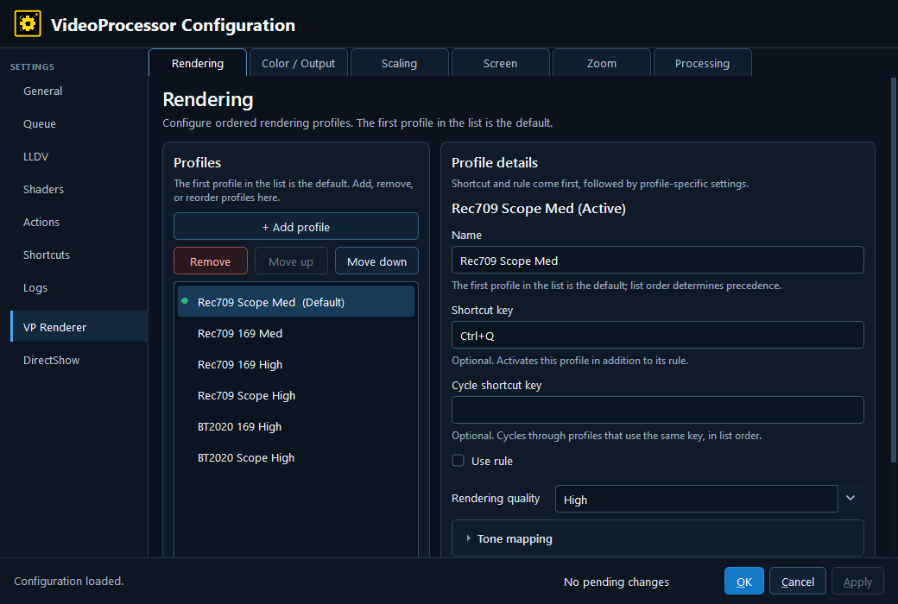

# 3. VP Renderer — Rendering

Rendering is a profile editor for the VP Renderer’s image-processing pipeline. It is intentionally separate from Color / Output: Rendering describes how source pixels are processed, while Color / Output describes the display calibration and transport target.

## Rendering quality

- **Rendering quality** — Selects the broad quality/performance preset: **High**, **Balanced**, or **Fast**. The preset can resolve several automatic choices below. The small status text under an **Auto** control is the effective choice after the preset and hardware are considered.

## Tone mapping

- **Target nits** — VP's target display peak/white policy in nits. It is the luminance target used when mapping HDR content to the configured display target; it is not a measurement of the current Windows HDR panel brightness.
- **HDR tone-map target black** — Target black level in nits. An explicit value is useful when the display’s black floor is known; **Auto** lets the profile use its normal default behavior.
- **Tone mapping** — Selects the HDR-to-target brightness curve, including black-point adaptation where applicable. **Auto** follows the selected quality preset and VP's normal behavior; the explicit choices include spline, BT.2390, ST 2094-40, and Reinhard in the current editor. Reinhard is retained for compatibility and is generally not the best choice for modern HDR.
- **Gamut mapping** — Handles colors outside the destination gamut, including colors made out of gamut by tone mapping. Perceptual and softclip preserve a more natural appearance than hard clipping; relative and desaturate are alternate policies for different calibration goals.
- **Peak detection** — Controls whether VP analyzes the picture to estimate scene or frame peaks. **High Quality**, **Standard**, **Off**, and **Auto** trade analysis cost, stability, and highlight adaptation. VP may rebuild this estimate after a source change or seek.
- **Contrast recovery (0 to 2)** — Separates high- and low-frequency components and adds part of the high-frequency component back after tone mapping. Zero disables it; larger values can restore perceived detail but may reveal ringing, with halos as a possible visual symptom.

Together, these settings determine how VP adapts the source to the display: tone mapping handles brightness, gamut mapping handles color range, and peak detection supplies information about the content being shown. The available choices and defaults come from the VP build and the selected profile.

## Processing

- **Debanding** — Reduces visible bands in smooth gradients. **Standard** and **Light** trade quality and GPU work; **Off** disables the pass.
- **Dithering** — Adds controlled noise or error diffusion before quantization to reduce banding. The editor exposes blue noise, ordered patterns, white noise, several error-diffusion kernels, **Auto**, and **Off**.
- **Display bit depth** — Chooses the precision target for the final rendered picture: **Auto**, **10-bit or higher**, or **8-bit**. This affects how VP prepares the signal and applies dithering; it is not a guarantee that Windows, the cable, or the panel is operating at that depth.

## Calibration ownership

The current beta keeps display calibration and calibration LUT controls on **Color / Output**, not on Rendering. Rendering retains the HDR target luminance/black policy, quality preset, tone mapping, gamut mapping, peak detection, debanding, dithering, and display-bit-depth controls. See [Color / Output](14-color-output.md) for the calibration method, target gamut, gamma, LUT slots, and output transport.

---

[← Configuration guide index](README.md)
