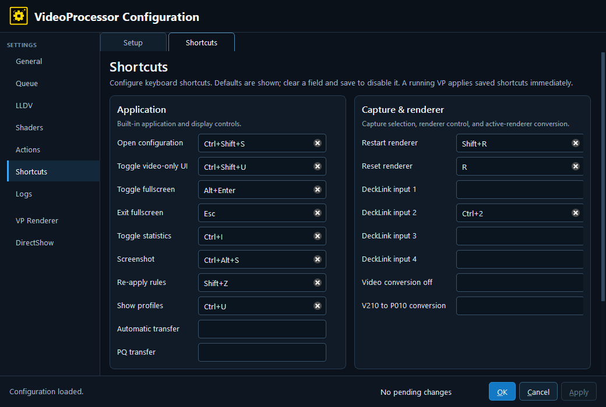

# 7. Shortcuts — Shortcuts

The Shortcuts tab assigns key chords. The editor validates chords and shows the built-in default where one exists. Clear and save a field to disable that shortcut.

## Application

- **Open configuration** — Opens the configuration editor.
- **Toggle video-only UI** — Toggles the normal UI/video-only presentation.
- **Toggle fullscreen** — Enters or leaves fullscreen.
- **Exit fullscreen** — Leaves fullscreen, normally mapped to Escape.
- **Toggle statistics** — Shows or hides the statistics overlay.
- **Screenshot** — Captures rendered output.
- **Re-apply rules** — Re-evaluates profile/action rules.
- **Show profiles** — Displays the active profile information.
- **Automatic transfer** — Returns transfer handling to automatic behavior.
- **PQ transfer** — Requests PQ transfer handling.

## Capture & renderer

- **Restart renderer** — Restarts the active renderer.
- **Reset renderer** — Resets renderer state.
- **DeckLink input 1–4** — Selects a numbered DeckLink input when available.
- **Video conversion off** — Disables the active video conversion.
- **V210 to P010 conversion** — Requests the V210-to-P010 conversion.

## Renderer selection

The renderer-selection card lists the renderers discovered on this PC. A shortcut selects a renderer by its one-based list position. Do not copy these numeric bindings between machines without checking the renderer order.

The screenshot shows the saved values in the captured deployment, not necessarily the built-in defaults in the current beta source. The current beta defaults include **Show profiles** = `Ctrl+Alt+I`, **Automatic transfer** = `Ctrl+Shift+A`, **PQ transfer** = `Ctrl+Shift+P`, DeckLink inputs = `Ctrl+1` through `Ctrl+4`, **Video conversion off** = `V`, and **V210 to P010 conversion** = `Shift+V`. Treat a blank or different screenshot value as a captured configuration value.

## Profile shortcuts

Profile editors also expose Shortcut key and Cycle shortcut key fields. Those are stored with the profile and select/cycle that profile family, rather than acting as global application shortcuts.

---

[← Configuration guide index](README.md)
