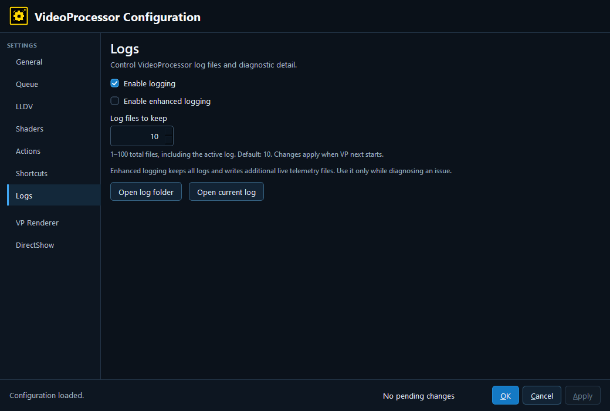

# 11. Logs

- **Enable logging** — Enables VideoProcessor log files. Logging is enabled by default in the current editor.
- **Enable enhanced logging** — Keeps all logs and writes additional live telemetry files. Use it while diagnosing a problem; it creates more diagnostic data.
- **Log files to keep** — Retains 1–100 total files, including the active log. Changes apply when VP next starts. When enhanced logging is enabled, the normal retention control may be unavailable because enhanced mode keeps the expanded set.
- **Open log folder** — Opens the directory containing VP logs. If the folder does not exist yet, start VP once and try again.
- **Open current log** — Opens the current `vp.log` when it exists.

When reporting a bug, include the relevant log and the configuration/profile values that reproduce it. Enhanced logging is useful for a short diagnostic capture, not as a permanent performance setting.

---

[← Configuration guide index](README.md)
