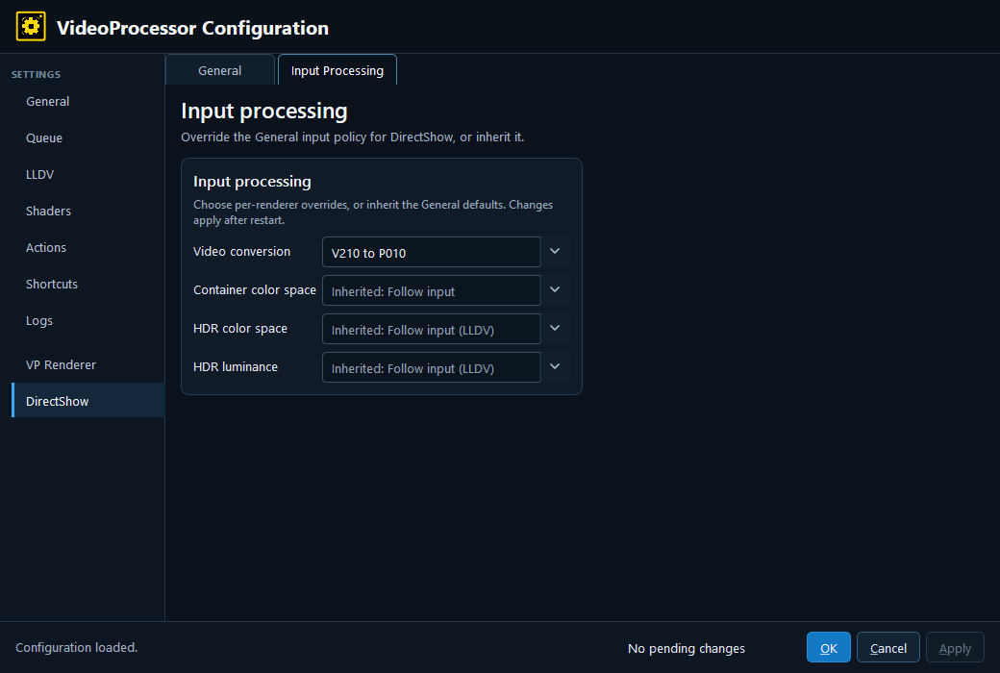

# 13. DirectShow — Input Processing

This tab has the same four input-policy fields as the VP Renderer Input Processing tab, but stores them for DirectShow:

- **Video conversion**
- **Container color space**
- **HDR color space**
- **HDR luminance**

Each can inherit the General value or override it for DirectShow. Keep the DirectShow override aligned with the renderer’s actual interpretation; a metadata override that fixes one DirectShow renderer can be wrong for another.

---

[← Configuration guide index](README.md)
