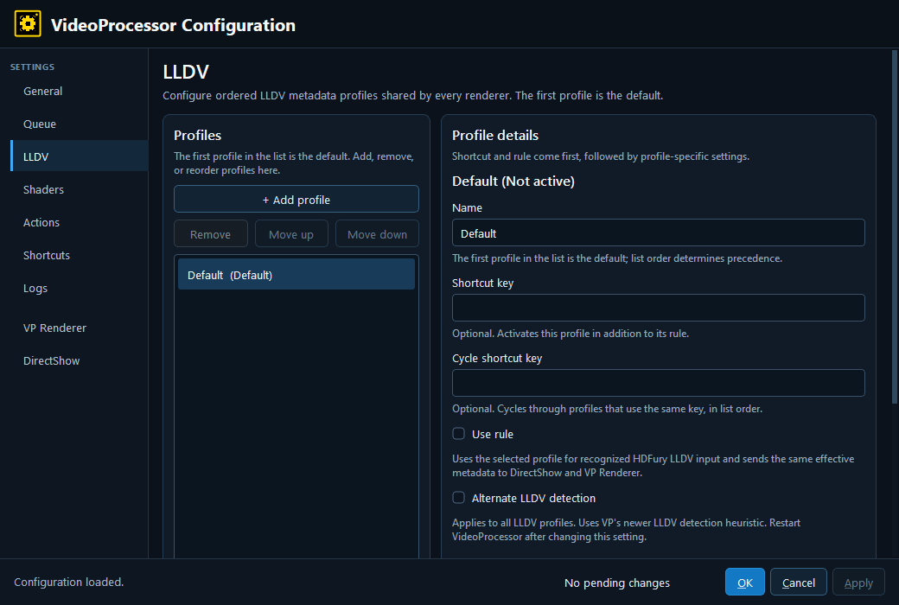

# LLDV

LLDV is an ordered profile list shared by the available renderers. The first profile is the default; shortcut, cycle, and rule selection choose among the configured LLDV metadata profiles. The selected profile supplies the Dolby Vision metadata used by the active renderer.

## Profile controls

Use the [shared profile controls](README.md#profiles-order-inheritance-and-rules) to add, remove, reorder, name, and select LLDV profiles. The current beta editor treats LLDV as a profile family, not as a single unselectable record.

- **Alternate LLDV detection** — Enables VP's newer LLDV detection heuristic. It applies to all LLDV profiles and requires a VideoProcessor restart after changing it.
- **MaxCLL** — Maximum content light level in nits.
- **MaxFALL** — Maximum frame-average light level in nits.
- **Mastering minimum** — Minimum mastering-display luminance in nits.
- **Mastering maximum** — Maximum mastering-display luminance in nits.

The legacy/default fallback values shown by the editor depend on whether alternate detection is active. Keep the four metadata fields internally consistent; together they should describe the Dolby Vision content expected by the display chain.

---

[← Configuration guide index](README.md)
