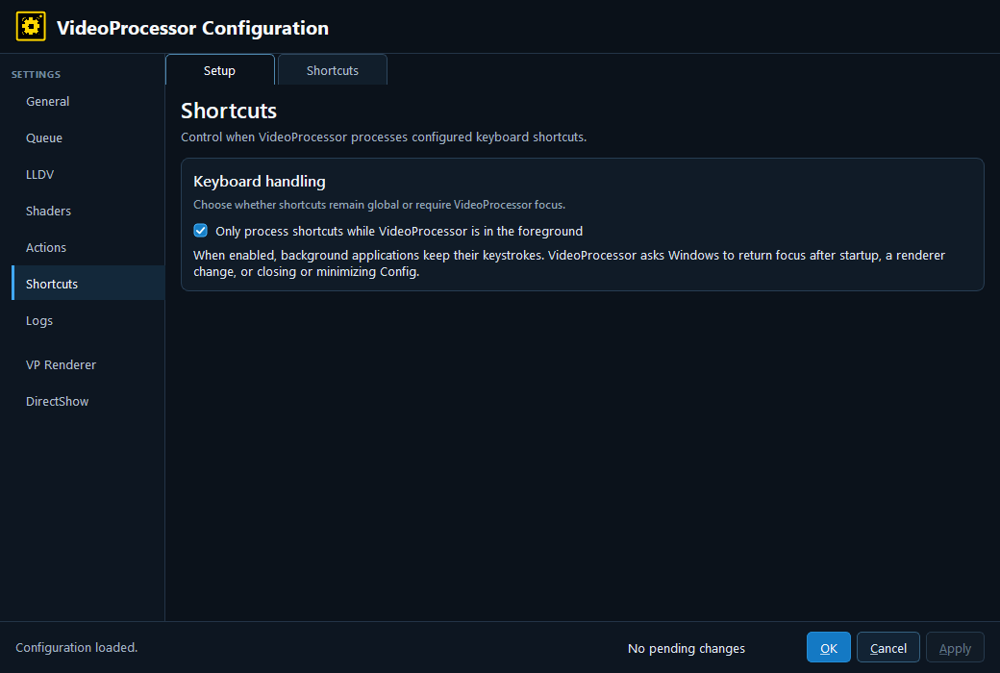

# Shortcuts — Setup

- **Only process shortcuts while VideoProcessor is in the foreground** — When enabled, background applications keep their keystrokes and VP responds only while focused. VP may return focus after startup, renderer changes, or closing/minimizing the configuration editor.

Leave this disabled when VP must respond to global control keys while another application has focus; enable it when global shortcuts interfere with other workstations or control software.

---

[← Shortcuts](6-shortcuts.md) · [Configuration guide index](README.md)
