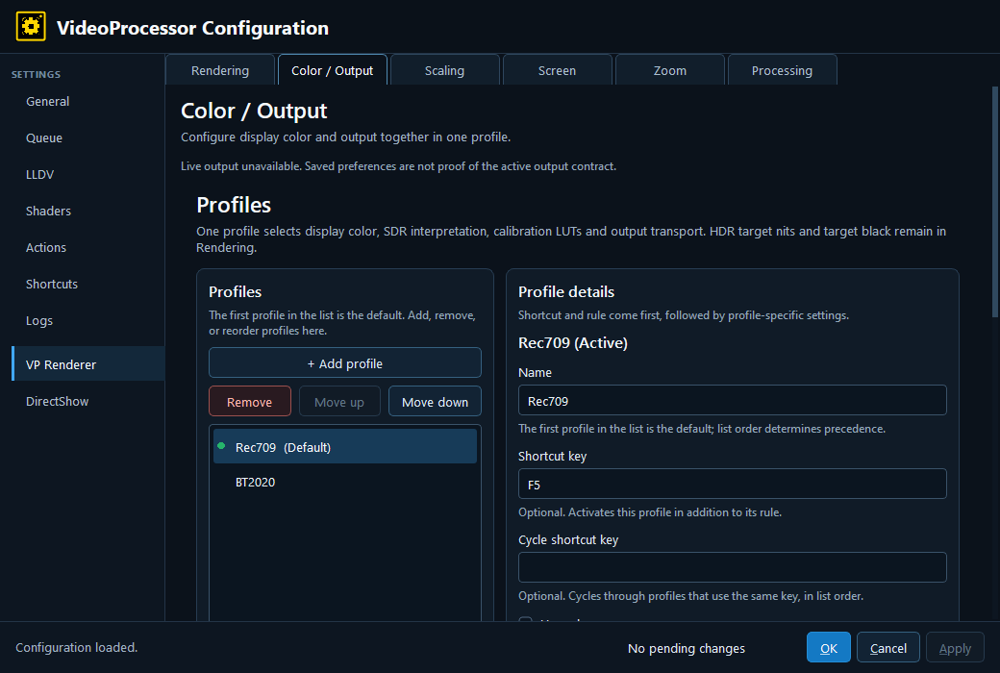
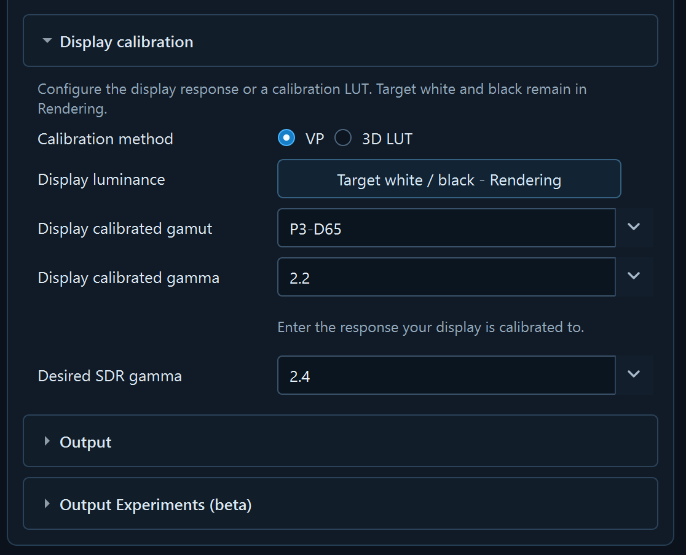
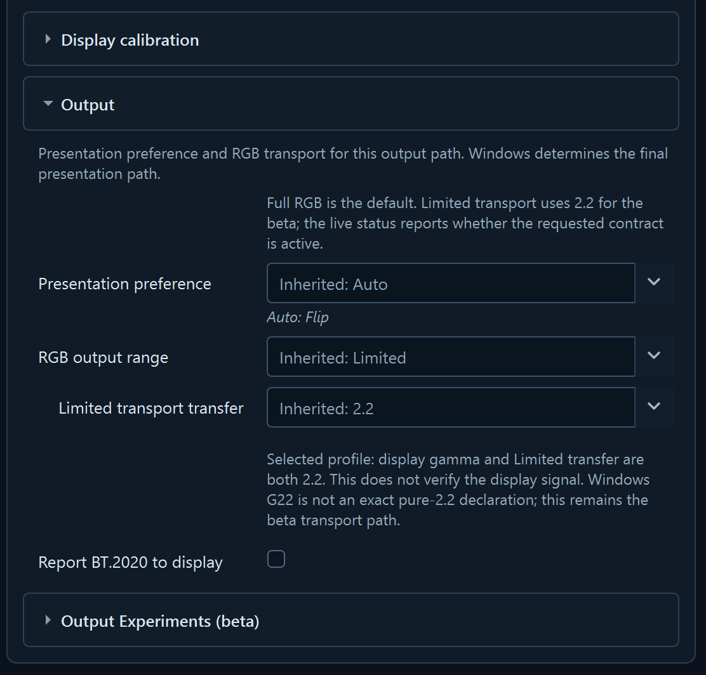
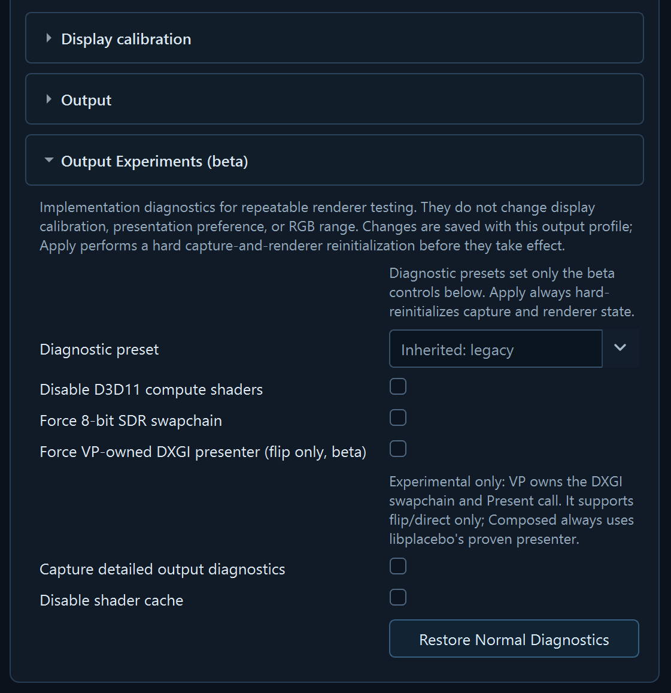

# VP Renderer — Color / Output

The current origin beta editor presents display calibration and output controls together on this tab. The old Output page redirects here. Use this screen when the question is “what display response and output behavior should the processed picture target?”

## Live status and display calibration

- **Live output status** — Reports the output settings currently being used by the running renderer, separately from unsaved edits. **Unavailable** means that VP cannot report the live state; it is not proof that saved preferences are active.
- **Enable display calibration 3D LUT** — Enables the calibration-LUT path for this Color / Output profile.
- **Calibration method** — **VP** uses the specified display gamut and gamma; **3D LUT** lets the selected calibration LUT handle display calibration.
- **Display luminance — Target white / black - Rendering** — Opens or links to the active Rendering profile's HDR target luminance/black settings. Those values remain Rendering-owned in this beta.
- **Target gamut** — Selects the target/calibration slot: Rec.709, P3-D65, or BT.2020.
- **Calibrated display gamma** — Describes the calibrated display response: sRGB or an explicit gamma from 1.8 through 2.8.

These are calibration-profile inputs. They describe the display target; they do not simply change the Windows desktop color declaration.

## SDR and HDR transfer

- **Enable SDR gamma processing** — Without a usable LUT, compensates for calibrated display gamma to produce the desired SDR response. With a usable LUT, VP preserves the source encoding through the pre-LUT transfer stage and the LUT handles calibration. **Use profile default** clears the per-profile override.
- **Desired SDR gamma** — Selects the desired SDR viewing response when no usable LUT is attached.
- **SDR reference gamma for LUT** — When LUT calibration is enabled, the same profile concept is presented as the SDR reference used to build the LUT.
- **SDR LUT input gamma** — With a usable LUT, declares the SDR input gamma for which the LUT was built. **No gamma conversion** preserves that stage; other choices include sRGB and explicit gamma values.
- **HDR LUT input gamma** — Tells VP which HDR encoding the LUT expects. It is used for HDR when a usable LUT is attached; the current beta's default is Gamma 2.2.

## Calibration LUT files

- **LUT file (Rec.709)** — Selects the `.cube` file for the Rec.709 target-gamut slot.
- **LUT file (P3-D65)** — Selects the `.cube` file for the P3-D65 slot.
- **LUT file (BT.2020)** — Selects the `.cube` file for the BT.2020 slot.
- **LUT attachment status** — Shows whether the selected file is attached and usable at runtime. A populated filename alone does not prove that calibration is active.
- **Open LUT folder** — Opens the directory where VP discovers `.cube` files.
- **Edit fallback settings** — Opens the fallback values used when a selected LUT is unavailable or rejected.

### Choosing the right `.cube` for a slot

A `.cube` is not a general-purpose correction. It was built for one specific starting point — a particular source
gamut *and* a particular source gamma — and it only does the right thing when the slot feeds it that starting
point. A file built for a 2.2 source loaded into a slot carrying a 2.4 signal still loads, still attaches, and
still produces a picture; it is simply correcting something other than what it is being given. Naming LUT files
after the gamut and gamma they assume makes the mismatch visible before it reaches the screen.

The same applies to code range. A correction built for full-range data and one built for legal-range data are the
same transform measured against a different ruler, and they are not interchangeable: using one where the other
belongs shifts black and white by roughly 44 code values, which shows up as crushed or washed-out rather than as
an obvious failure.

Neither mismatch is reported. Both produce a plausible picture, so check the file against the slot rather than
waiting for a warning.

The `.cube` discovery, target-gamut slots, gamma labels, attachment status, and fallback workflow are VP-owned UI concepts. libplacebo supports multiple LUT roles, so the exact effect of an imported LUT depends on how VP binds that file; the guide should not imply that every LUT path applies every normal color-mapping stage unchanged.

In this beta, Color / Output contains the display target, target gamut, calibrated display gamma, SDR reference, LUT enablement and files, HDR LUT input gamma, presentation preference, RGB range, limited transport transfer, and output diagnostics. Rendering retains target luminance/black, quality, tone mapping, and general processing choices.

## Output

- **Presentation preference** — **Prefer flip (allow fallback)**, **Flip model**, or **BitBlt model**. These describe the preferred presentation model; they do not guarantee that Windows will promote a surface to independent flip or bypass composition.
- **RGB output range** — **Full** or **Limited**.
- **Limited transport transfer** — Transfer declaration for Limited RGB transport: 2.2 or 2.4.
- **Limited 2.2 beta transport (derived)** — Read-only/derived state that reflects the Limited + 2.2 pairing.
- **Report BT.2020 to display** — Controls the BT.2020 display-signaling request in the output path.
- **Compatibility status** — Read-only notes that explain an incompatible or constrained combination.

## Output Experiments (beta)

These controls are diagnostic/experimental rather than normal calibration controls:

- **Diagnostic preset** — Normal diagnostics, Output investigation, or Custom diagnostics.
- **Disable D3D11 compute shaders** — Uses a simpler graphics path for diagnosing driver or hardware problems.
- **Force 8-bit SDR output** — Forces 8-bit SDR output for investigation.
- **Force VP-owned presenter (flip only, beta)** — Forces VP's beta presentation path for investigation.
- **Capture detailed output diagnostics** — Collects additional output-path diagnostics.
- **Disable shader cache** — Disables the persistent shader cache for diagnostic isolation.
- **Restore Normal Diagnostics** — Returns the experiment controls to the normal diagnostic baseline.

Change experiment controls only while testing a specific output-path hypothesis. Record the original values before changing them.
Applying these diagnostics can perform a hard capture-and-renderer reinitialization. Expect the active video path to restart.

## HDR gamma and luminance boundary

When a usable HDR LUT is attached, **HDR LUT input gamma** tells VP how the HDR picture is encoded before the LUT is applied. Rendering's **Target nits**, **HDR tone-map target black**, **Peak detection**, and tone-mapping settings still describe the normal picture-processing choices. A LUT corrects color according to its role; it does not automatically bypass every other processing step.

---

[← VP Renderer](8-vp-renderer.md) · [Configuration guide index](README.md)
