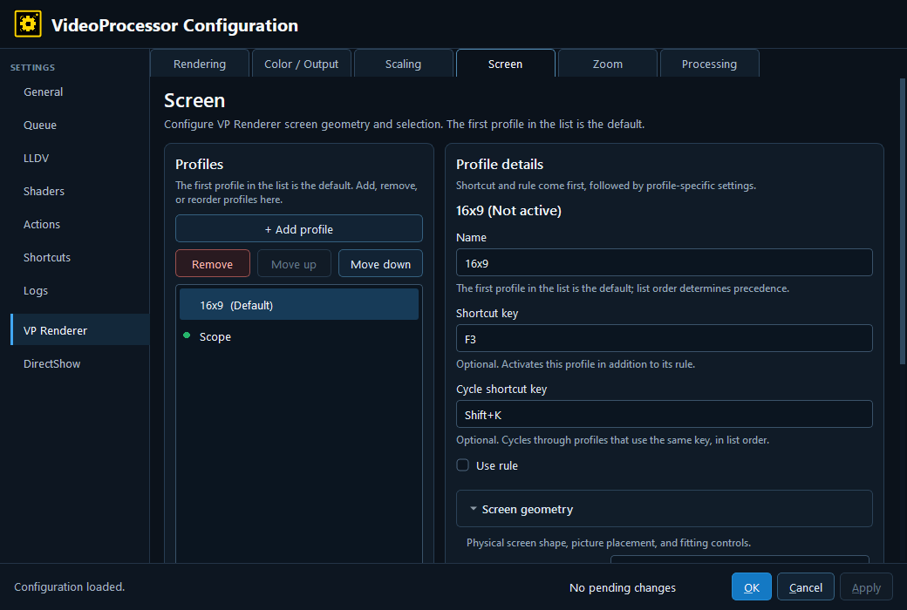

# VP Renderer — Screen

Screen profiles describe the physical presentation geometry and screen-relative behavior. Screen selection is independent from Zoom selection.

## Screen geometry

- **Screen aspect ratio** — Declares the target screen shape. Enter a ratio such as `16:9`, `32:15`, or a pixel-style ratio such as `2100x1000`.
- **Vertical picture alignment** — Places the picture at the top, center, or bottom of the screen when the active geometry leaves vertical space.
- **Enable anamorphic lens compensation** — Enables lens expansion compensation for an anamorphic setup.
- **Lens expansion ratio** — Supplies the expansion ratio used when anamorphic compensation is enabled. `1:1` means no expansion.

## Subtitles and picture placement

- **Keep subtitles inside screen bounds** — Prevents subtitle placement from extending outside the usable screen area.
- **Subtitle hold** — Time, in milliseconds, for subtitle stability/hold behavior.
- **Subtitle engage drift** — Motion/position drift threshold in milliseconds before subtitle handling engages.
- **Subtitle release drift** — Threshold before the subtitle handling is released.
- **Subtitle padding** — Padding around the subtitle-safe area, in pixels.
- **Subtitle target buffer** — Additional target buffer around subtitle placement, in pixels.

## HDR analysis protection

The HDR analysis controls are VP-specific policy layered on the bundled libplacebo peak-analysis path. They keep subtitles, overlays, or non-picture regions from distorting peak analysis; they do not crop the displayed picture.

- **Limit HDR analysis to picture center** — Restricts analysis to the central picture region.
- **Protect HDR analysis during subtitle movement** — Adds protection while subtitles move.
- **HDR analysis protection** — Selects Off, Smart (Experimental), or Percentage (Beta).
- **HDR analysis height** — Percentage of the picture used for fixed/percentage protection.
- **HDR analysis position** — Places the protected/analysed region at the top, center, or bottom.

## HDR metadata override

Where shown in the expanded profile, these fields supply metadata values in nits:

- **MaxCLL** — Maximum content light level.
- **MaxFALL** — Maximum frame-average light level.
- **Mastering minimum** — Minimum mastering-display luminance.
- **Mastering maximum** — Maximum mastering-display luminance.

Use metadata overrides only when the source metadata is absent or known to be wrong. They describe the content signal; they do not change the physical display’s peak capability.

---

[← VP Renderer](8-vp-renderer.md) · [Configuration guide index](README.md)
